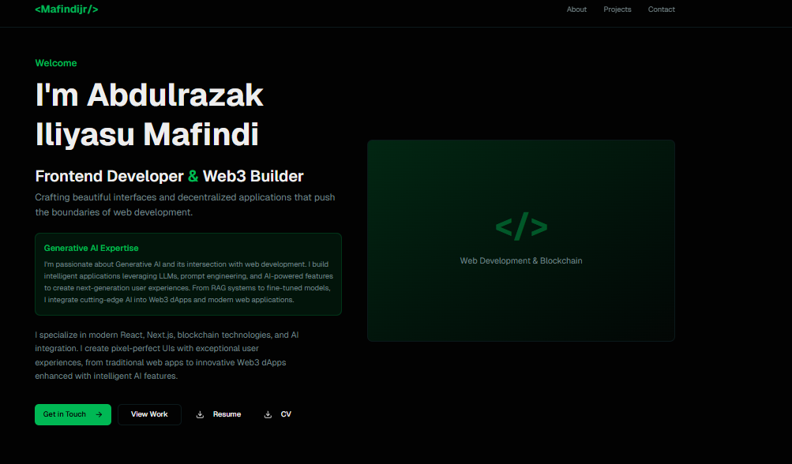

# Abdulrazak Portfolio

A modern personal portfolio for **Abdulrazak Iliyasu Mafindi** showcasing frontend engineering, Web3 development, smart contract work, REST API integration, and AI-powered user experiences.

Live site: https://mafindijr.vercel.app/

## GitHub Description

Frontend & Web3 portfolio built with Next.js, TypeScript, Gemini AI chat, REST API integration, and Solidity smart contract experience.

## About This Portfolio

This project is designed to present Abdulrazak's work, technical strengths, and professional story in one experience.  
It includes an AI assistant that answers portfolio-specific questions, a production-ready contact workflow, and dedicated sections for projects, experience, certifications, community impact, and more.

## Key Features

- Responsive portfolio UI for desktop and mobile
- Sections for Hero, Projects, Experience, About, Certifications, Community, and Contact
- Downloadable resume support (`public/Mafindijr_Resume.pdf`)
- AI chat widget powered by Gemini (`/api/chat`)
- Contact form with email delivery via NodeMailer + Gmail SMTP (`/api/contact`)
- Vercel Analytics integration
- Smooth interactive motion using Framer Motion

## Skills Highlighted

- HTML, CSS, JavaScript/TypeScript
- React, Next.js, Tailwind CSS
- REST API integration
- Web3 and decentralized application (dApp) development
- Solidity and smart contract development
- AI integration, prompt engineering, and RAG-oriented workflows

## Tech Stack

- Next.js 16
- React 19
- TypeScript
- Tailwind CSS 4
- Framer Motion
- Gemini API (`@google/generative-ai`)
- NodeMailer
- Vercel Analytics

## Project Structure

```text
app/
  api/chat/route.ts        # Gemini-powered portfolio assistant
  api/contact/route.ts     # Contact email endpoint
  layout.tsx               # Global layout + chat widget mount
  page.tsx                 # Main portfolio sections
components/
  chat/                    # Chat button, panel, and widget
  hero.tsx
  projects.tsx
  experience.tsx
  about.tsx
  certifications.tsx
  community.tsx
  contact-form.tsx
public/
  Mafindijr_Resume.pdf
  screenshots/screenshot.png
```

## Environment Variables

Create a `.env.local` file in the project root:

```env
GEMINI_API_KEY=your_gemini_api_key
NEXT_EMAIL_USER=your_gmail_address
NEXT_EMAIL_PASS=your_gmail_app_password
```

Notes:
- `GEMINI_API_KEY` is required for the AI assistant route.
- `NEXT_EMAIL_USER` and `NEXT_EMAIL_PASS` are required for the contact form email delivery.
- For Gmail SMTP, use an App Password (not your regular account password).

## Getting Started

Prerequisite:
- Node.js 18+ recommended

Install dependencies:

```bash
npm install
```

Run development server:

```bash
npm run dev
```

Build and run production:

```bash
npm run build
npm run start
```

Lint:

```bash
npm run lint
```

## API Endpoints

- `POST /api/chat`
Returns a portfolio-focused AI response based on user message.

- `POST /api/contact`
Accepts `name`, `email`, `subject`, and `message`, then sends email to configured inbox.

## Screenshot



## Deployment

Optimized for Vercel deployment.

## Contact

- GitHub: https://github.com/mafindijr
- Portfolio: https://mafindijr.vercel.app/
